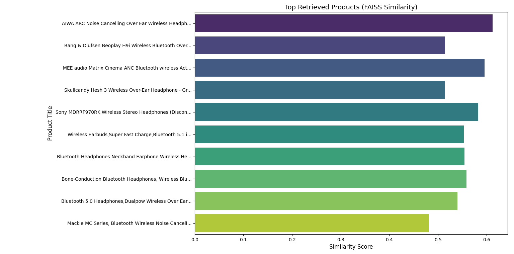

# NLPSearchEngine
# Semantic Search and Ranking System

# Overview

This project implements a **Semantic Search and Ranking System** that leverages **FAISS** (Facebook AI Similarity Search) for efficient nearest neighbor search on embeddings generated by **Sentence Transformers**. The system is designed to retrieve and rank e-commerce products based on metadata, reviews, and user queries, incorporating **Gemini AI integration**, **price filtering**, **cross-encoder re-ranking**, sentiment analysis, and **enhanced visualizations**.

# Features

- **Semantic Search**: Uses FAISS for fast and scalable similarity searches.
- **Enhanced Ranking System**:
  - **Metadata similarity** (FAISS-based)
  - **Review relevance** (FAISS-based)
  - **Price filtering** (Spacy NLP-based)
  - **Cross-encoder re-ranking** (`cross-encoder/ms-marco-MiniLM-L-6-v2`)
- **Gemini AI Integration**:
  - Summarizes key product features & reviews.
  - Provides AI-powered product recommendations.
- **Sentiment Analysis**: Evaluates customer sentiment in reviews to adjust rankings.
- **Improved Visualizations**: Uses Seaborn and Matplotlib for ranking comparisons, sentiment impact, and FAISS retrieval scores.

# Files and Directories

## Source Code

- **`data_retrieval.py`**:
  - Handles **data loading, preprocessing, and embedding generation**.
  - Saves cleaned metadata and aggregated reviews.
  - **Uses the updated embedding model** `all-mpnet-base-v2`.

- **`semantic_retrieval.py`**:
  - **Performs FAISS-based search** and ranking.
  - **Extracts price constraints** from user queries.
  - **Uses Gemini AI** for AI-driven product insights.
  - **Implements cross-encoder re-ranking** for better ranking refinement.
  - Provides **structured explanations** for ranking scores.

- **`visualize.py`**:
  - Contains **improved visualizations** for:
    - FAISS retrieval comparisons.
    - Ranking score comparison (before and after re-ranking).
    - Sentiment and rating impact analysis.

## Additional Files

- **`requirements.txt`**: Lists all required Python dependencies.
- **Images**:
  - : Bar chart for FAISS search distances.
  - : Bar chart comparing original vs. weighted scores.
  - : Scatter plot showing sentiment's impact on rankings.

## Directories

- **`data/`**: Stores the e-commerce dataset and SQLite database.
- **`models/`**: Stores embeddings and FAISS indices.
- **`output/`**: Stores cleaned data and aggregated reviews.

# Installation

## Prerequisites

- Python 3.8+
- A valid **Gemini AI API Key**

## Steps

1. Clone the repository:

    ```bash
    git clone https://github.com/luciforge/NLPSearchEngine
    cd NLPSearchEngine
    ```

2. Install dependencies:

    ```bash
    pip install -r requirements.txt
    ```

3. **Set up Gemini AI API Key**:

    You must set up the `GENAI_API_KEY` environment variable before running the system.

    - **Linux/macOS**:
      ```bash
      export GENAI_API_KEY="your_api_key_here"
      ```

    - **Windows (PowerShell)**:
      ```powershell
      $env:GENAI_API_KEY="your_api_key_here"
      ```

    - **Windows (Command Prompt)**:
      ```cmd
      set GENAI_API_KEY=your_api_key_here
      ```

4. **Prepare data**:

    - Place the SQLite database in the `data/` directory.
    - Run `data_retrieval.py` to clean data and generate embeddings.

    ```bash
    python data_retrieval.py
    ```

5. **Build FAISS indices**:

    ```bash
    python index.py
    ```

# Usage

1. **Start semantic retrieval**:

    ```bash
    python semantic_retrieval.py
    ```

2. **Enter a search query** when prompted and view the ranked results.
3. **Generated visualizations include**:
   - FAISS search distances (`distance_match.png`)
   - Ranking comparison (`ranking_comparisons.png`)
   - Sentiment impact on rankings (`sentiment_analysis.png`)

# Visualizations

- **FAISS Search Results**: Displays the similarity distances for top-K results.  
  

- **Ranking Comparison**: Compares scores before and after applying weights.  
  

- **Sentiment Impact**: Shows how sentiment affects the ranking process.  
  

# Technologies Used

- **FAISS**: For similarity search.
- **Sentence Transformers**: For embedding generation.
- **Gemini AI**: For intelligent product insights.
- **Cross-Encoders**: For improved ranking re-ranking.
- **NLTK & Spacy**: For NLP-based sentiment analysis and price extraction.
- **Seaborn & Matplotlib**: For enhanced data visualization.

# Dependencies

Refer to `requirements.txt` for the full list of dependencies:

- `matplotlib`
- `numpy`
- `pandas`
- `faiss-cpu`
- `sentence-transformers`
- `spacy`
- `nltk`
- `scikit-learn`
- `seaborn`
- `google-generativeai`

# Acknowledgments

- FAISS and Sentence Transformers for embedding and search.
- Gemini AI for product recommendations.
- Cross-Encoder models for ranking refinement.
- Seaborn for enhanced visualizations.

# License

This project is licensed under the MIT License.
